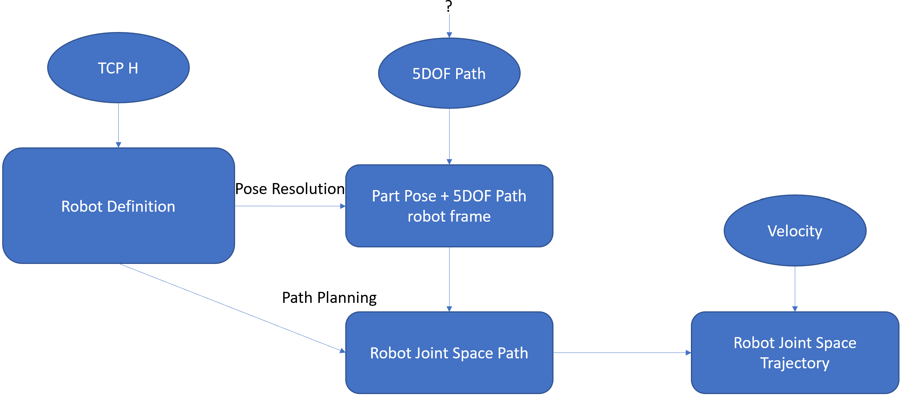
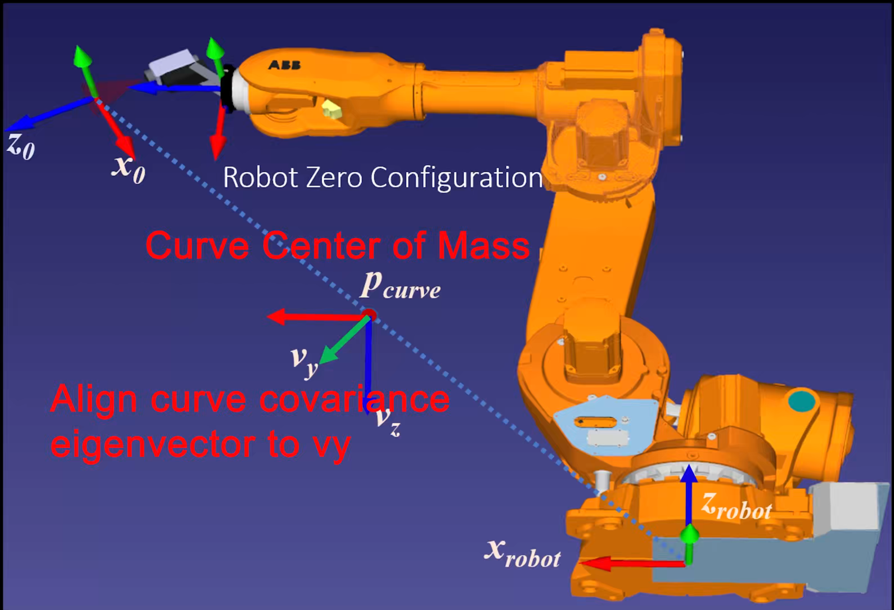

# Robotic_spindle

Robotic Spindle Application using Tormach ZA06 Robot and ATI F/T Sensor

## Workflow

## Trajectory Generation
5DOF trajectory -> 6 DOF robot joint space trajectory algorithm comes from (https://github.com/hehonglu123/Motion-Primitive-Planning)
 
* `data/` contains different 5DOF trajectories
* `data/baseline.py` generate relative curve pose with reasonable industry practice, and uses QP to resolve redundant DOF along the path
* `traj_exec.py` index `data/<dataset>/Curve_js.csv` with time according to specified constant velocity, and send out trajectory to robot.
